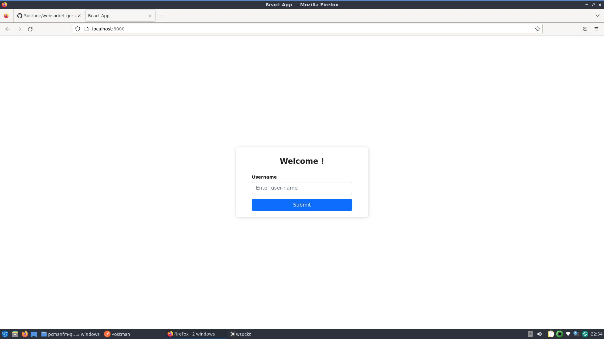
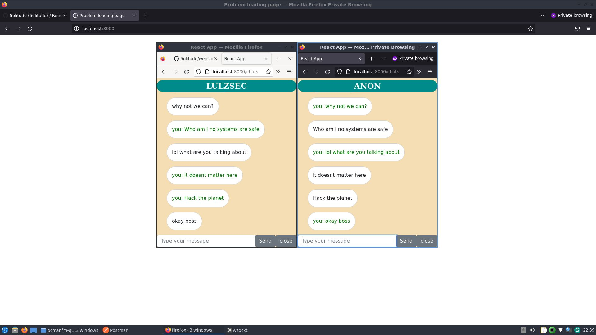

# websocket-golang

 This is a simple websocket real time texting web application written in golang gorilla mux and react js

## features 
    - Private Chat one to one chat
    - Chat auto scroll feature 
    - List online users

### Implementation 

    * WS Server is wriiten in golang 
    * The client interaction part is written in React

### code  structure 
    * websocketgolang/ui/src/
       ** signin.js (a simple login screen to enter the user name)
       ** basic.js  render two components conditionally. if a user selected someone to chat the connected variable will set to true and the chat page will be displayed else if user press close button from chat page the connected variable is set to false and return the user back to the online users list page
       ** App.js routing paths 

#### methods 
  
     When a user joins and selected someone to text , an object with the selected username will be created , something like this 
       
       ** { [username:"anon" "msns":["1"........],username:"an","msns":[....]]}
     If the slected user object already exists in array the message will be appended to msns.
     If not ,the user will be created with null fields as object
     If the length of msns length > 20 the first array element will be deleted as the new message arrives
#### flaws 
     Unique username is not implemented in  the server side , you can implement it inside handlers/socket-handlers.go make changes in find usernameByuserid function
     Initial user connection requires a refresh sometimes

#### How to run the program ?
     * cd websocketgolang
     * go run .
     * open browser and type localhost:8000

